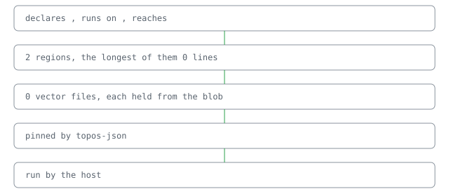

# @lapxo/topos-json

     

A document says what it holds.

Point a JSON document at it and it reads what the document says of itself, and the names the document cites. [its regions, read off its own descriptor](docs/reference.md)

## Why two readings

A document says what it holds, and it cites the names it is built from. Both readings are the same document.

## One document, two readings

## What it claims

- **It costs 1 dependencies: the SDK it answers through.** · [receipt](receipts.bound)

## Line

Add to your lock:
sources/topos-json value=github:Lapxo/topos-json
uses/topos-json sha256:<release digest>
Fetch the release asset, verify its sha256 equals the uses/ line, place it in bound/cas/blobs/. Fold: its pages appear.
open: line/install needs=host/resolve — when bound resolves sources/ itself, the fetch line leaves the page by fold.

It rests on topos.

## Check

● 0 cases hold

● `npm ci && npm run build`
